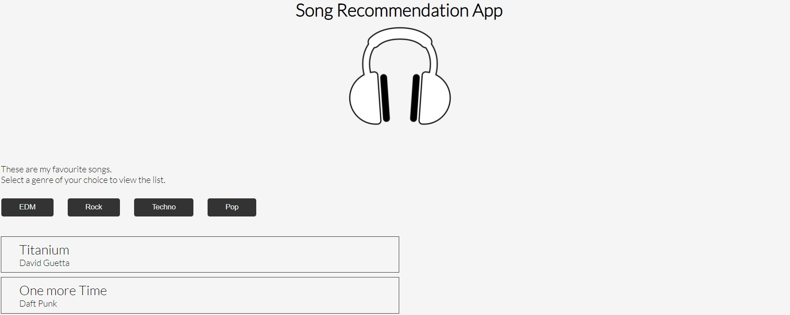

# Song Recommendaton App

## Description

###### (levelZero_markNine)

Display the list of songs based on genre selection.

The data is present in the form of an object. It contains the genre as an array. The array further contains the name of the song and the name of the artist.



### My learnings

Object.keys(): This javascript built-in method takes an object as an argument and returns the array of strings representing all the enumerable properties of a given object.

#### Tech Stack

React, CSS

## Installation

```bash
git clone https://github.com/anshulraheja/levelZero_markNine.git
npm install
```

CodeSandBox [Link](https://codesandbox.io/s/github/anshulraheja/levelZero_markNine)
